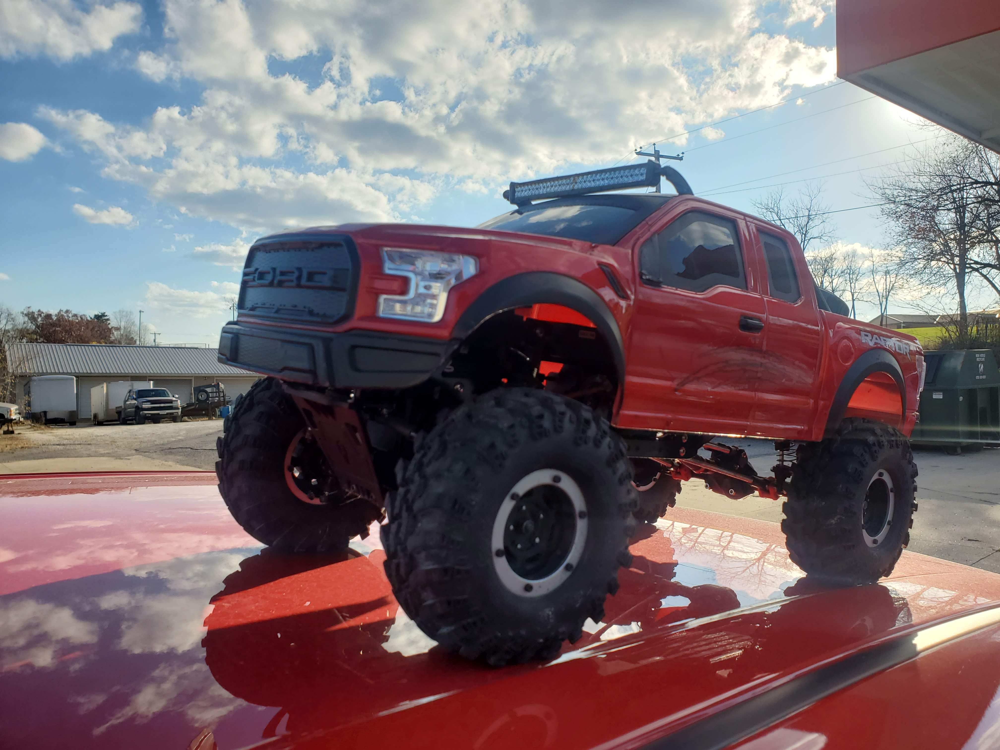

## Experience
---

**I graduated from University High School in Normal, IL in 2020 and am pursuing a B.S. degree in IT at Unversity of Columbia, Missouri. My programming experience mostly consists of Java and some Python, HTML, JS, and Markdown.**

*Here is a program I wrote in Java to solve the Tower of Hanoi puzzle, not including the **Runner** class:*

---
```
import java.awt.Color;
import java.awt.Dimension;
import java.awt.GradientPaint;
import java.awt.Graphics;
import java.awt.Graphics2D;
import java.util.Stack;
import java.util.ArrayList;
import javax.swing.JPanel;

public class TowerOfHanoi extends JPanel {

    private static final long serialVersionUID = 1L;
    ArrayList<Stack<Integer>> towers;

    public TowerOfHanoi() {
        setPreferredSize(new Dimension(720, 400));
        setBackground(Color.LIGHT_GRAY);
        towers = new ArrayList<Stack<Integer>>();
        Stack<Integer> s = new Stack<Integer>();
        for (int i = 10; i > 0; i--) {
            s.push(i);
        }
        towers.add(s);
        towers.add(new Stack<Integer>());
        towers.add(new Stack<Integer>());
    }

    public void run() {
        moveDisks(10, 0, 1, 2);
    }

    public void moveSingleDisk(int startPole, int destinationPole) {
        Stack<Integer> source = towers.get(startPole);
        Stack<Integer> destination = towers.get(destinationPole);
        if (destination.empty() || source.peek().compareTo(destination.peek()) < 0) {
            destination.push(source.pop());
        } else {
            throw new RuntimeException(
                    "Can't put disk size " + source.peek() + " onto disk size " + destination.peek());
        }
        delay(50);
        repaint();
    }

    public void moveDisks(int d, int start, int mid, int end) {
        if (d == 0) {
            return;
        }
        moveDisks(d - 1, start, end, mid);
        moveSingleDisk(start, end);
        moveDisks(d - 1, mid, start, end);
    }

    public void paintComponent(Graphics g) {
        super.paintComponent(g);
        Graphics2D g2 = (Graphics2D) g;
        GradientPaint gp = new GradientPaint(360, 0, Color.BLUE, 360, 400, Color.BLACK);
        g2.setPaint(gp);
        g2.fillRect(0, 0, 720, 400);
        g.setColor(Color.BLACK);
        g.fillRect(117, 160, 6, 220);
        g.fillRect(357, 160, 6, 220);
        g.fillRect(597, 160, 6, 220);

        for (int i = 0; i < 3; i++) {
            Stack<Integer> s = towers.get(i);
            for (int j = 0; j < s.size(); j++) {
                Integer disk = s.get(j);
                drawDisk(g, i, j, disk.intValue());
            }
        }
    }

    public void drawDisk(Graphics g, int pole, int layer, int diskSize) {
        Graphics2D g2 = (Graphics2D) g;
        GradientPaint gp = new GradientPaint(0, 400, Color.BLUE, 400, 0, Color.RED);
        g2.setPaint(gp);
        int x = 120 + 240 * pole;
        int y = 360 - 22 * layer;
        int width = diskSize * 20;
        g.fillRoundRect(x - width / 2, y, width, 20, 10, 10);
    }

    public void delay(int n) {
        try {
            Thread.sleep(n);
        } catch (InterruptedException ex) {
            Thread.currentThread().interrupt();
        }
    }

}
```
---
Besides programming, I have engineering experience with building, modifying, and repairing various devices such as computers, bicycles, and remote control vehicles. **[Here](https://photos.app.goo.gl/p42X9M8gGHEwWnZT9)** is an album of my recent rc crawler project, which I am currently modifying and rebuilding. 

 "How she looked before the mud and rollovers"

---
<- [*About Me*](README.md)

[*Favorites*](favorite.md)->

[*Page 4*](page4.md) -->

[*Page 5*](page5.md) --->