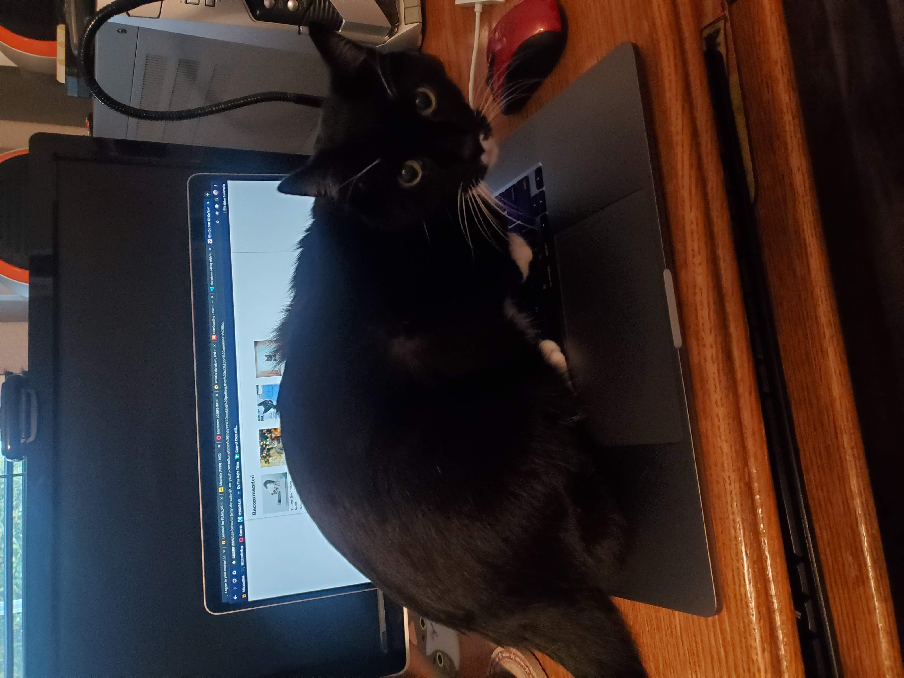

## My Favorite Things

- Color: Red
- Animal: Cat
- Show: Top Gear UK
- Sports Team: Chicago Bulls
- Artist: FM-84
- Movie: Wall-E
- Subject: Engineering
- Programming Languauge: Java
```
class HelloWorld {
    public static void main(String[] args) {
        System.out.println("Hello, World!"); 
    }
}
```
 "Muffin" 

---
- <--- [*About Me*](README.md)
- <-- [*Programming Experience*](exp.md)
- <- [*Projects*](project.md)
- [*Wrap-Up*](wrapup.md) ->