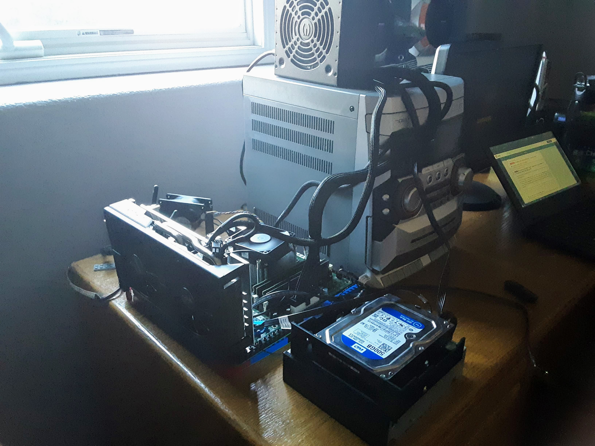

## Projects

Besides programming, I have engineering experience with building, modifying, and repairing various devices such as computers, bicycles, and remote control vehicles. **[Here](https://photos.app.goo.gl/p42X9M8gGHEwWnZT9)** is an album of my rc crawler. 

 "How she looked before the mud and rollovers"

---

[Here](https://photos.app.goo.gl/eXsQUx4WaEwwNv9p6) is another album for a gaming PC that I built using a Dell Optiplex 7010 motherboard, various components scrounged from eBay, and a case from Facebook Marketplace.

 "Testing everything before I got a case. Safe? Maybe."

---
- <-- [*About Me*](README.md)
- <- [*Programming Experience*](exp.md)
- [*Favorite Things*](favorite.md) ->
- [*Wrap-Up*](wrapup.md) -->